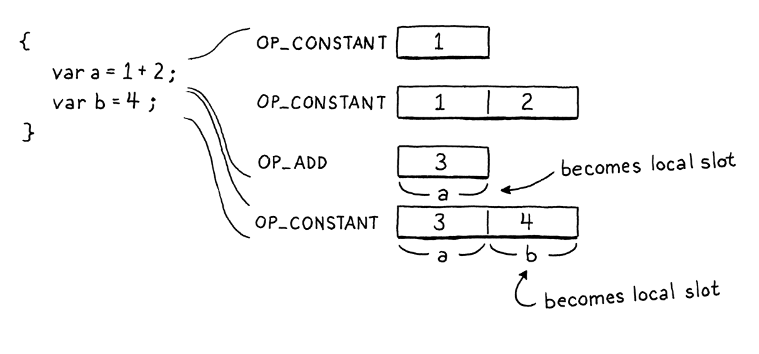

statement -> exprStmt
           | forStmt
           | ifStmt
           | printStmt
           | returnStmt
           | whileStmt
           | blockStmt

declaration -> classDecl
             | funDecl
             | varDecl
             | statement;

A statement has 0 effect on the VM stack, it only uses value from the stack. If it did have an effect on the stack,
it'd cause stack under/over flow. 

Expressions on the other hand have a stack effect that describes how that instruction modifies the stack. We can calculate the net effect on stack
by suming up each instruction's effect in an expression.

Representation of how local variables are working.
